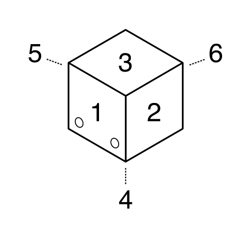

# DiceesJS

## Table of Contents

1. [Introduction](#introduction)
2. [Installation](#installation)
3. [Usage](#usage)
4. [Dicees Display Manipulation](#dicees-display-manipulation)
5. [Dicees Simulation](#dicees-simulation)
6. [Test with real Dicees](#test-with-real-dicees)
7. [Methods](#methods)


## Introduction

DiceesJS is a JavaScript SDK allowing you to create applications and games for the official Dicees Application.

Creating an app for Dicees is as simple as creating a web page, you can use HTML, CSS and JavaScript as you would usually do and our SDK will allow you to interact with the Dicees App itself and the Dicees.

## Installation

### Script tag
```
<script src='path_to/dicees.js'></script>
```

### Babel
```
import 'path_to/dicees.js';
```

## Usage

Since the Dicees App uses Bluetooth to interact with the Dicees, every method returns a Promise.
It is then highly recommended for you to wait until the completion of each Promise before using any other method of the DiceesJS library.

### ES5 example

```
var promise = Dicees.rollDicees();
promise.then(function(results){
  console.log(results);
});
```

### ES6 example

```
let promise = Dicees.rollDicees();
promise.then((results) => {
  console.log(results);
});
```

### ES8 async/await example

```
async function makeARoll(){
  let results = await Dicees.rollDicees();
  console.log(results);
}

makeARoll();
```

**Note**: If you are using DiceesJS in a babel environment, you will need to use `window.Dicees` instead of `Dicees`.

## Dicees Display Manipulation

### Skin concept

What is a skin:

* A skin is the color of every single LED recorded in memory of a Dicees, when you tell a Dicees to show a specific skin, it will display these colors.
* Each Dicees can retain up to 4 skin (current version).
* The methods that manipulate LEDs colors have an optional parameter allowing you to specify the skin that will be used to apply your changes (default is skin 1).
* Skin number can take these values: 0 → 3

### Faces, lines and columns

* Face number can take these values: 1 → 6 (face number 6 is always up when you charge a Dicees)
* Line number can take these values: 0 → 4
* Column number can take these values: 0 → 4

### Dicees face helper



## Dicees Simulation

While you are still creating your app, you will certainly want to know if your application would work in the Dicees Application. Luckily for you, the DiceesJS SDK allows to simulate everything in your browser.

### Simulate a throw

If you are connected to the Dicees App, the method rollDicees() would normally wait for you to throw the Dicees before giving you the results.

In development, while your app is waiting, you can press your F2 key to simulate the throw.

```
async function makeARoll(){
  //The app will wait here until you throw the Dicees
  //Or until you press F2
  let results = await Dicees.rollDicees();
  console.log(results);
}

makeARoll();
```

**Note**: This also stands for rollDiceesByIds()

### Simulate a pick up

If you are connected to the Dicees App, the method pickUp() would normally wait for you to pick up the Dicees before executing the rest of your script or your callback function if you are not using await.

In development, while your app is waiting, you can press your F3 key to simulate the throw.

```
async function askPickUp(){
  //The app will wait here until you pick up the Dicees
  //Or until you press F3
  await Dicees.pickUp();
  //Code that should be executed after the pick up
  //...
}

askPickUp();
```

**Note**: This also stands for pickUpByIds()

### Simulate a reroll

If you are connected to the Dicees App, the method rollDiceesAutoDetect() would normally wait for you to pick up a certain amount of Dicees then, once the first of those is thrown, will wait for all the picked up Dicees to be thrown before giving you the results.

In development, while your app is waiting, you can use the digit keys of your keyboard (1 to 5) to pick up the Dicees you want to reroll, you can then press F2 to roll those Dicees and get the results.

```
async function makeAReroll(){
  //The app will wait here until you throw the Dicees
  //Or until you select the Dicees you want to roll using the digit keys and then press F2
  let results = await Dicees.rollDicees();
  console.log(results);
}

makeAReroll();
```

**Note**: This also stands for rollDiceesAutoDetectByIds()
If you do rollDiceesAutoDetectByIds([0, 2, 3]), you will need to use the 1, 3 and 4 digit keys for the pick up.

### Life-counter simulation

If you switch a Dicees or multiple Dicees in Life Counter mode, you can also simulate their usage in your browser. Since a keyboard does not have an infinite number of keys, once your Dicees are in Life Counter mode, you will need to set a focus on a dice using your digit keys (1 to 5). Once the focus is set, you can use the NumPad to simulate the behavior of the dice (2 for -10, 4 for -1, 6 for +1 and 8 for +10). You can change your focus at any time using the digit keys (1 to 5).

Each change in focus or in life value will be displayed in your web console.

```
async function switchToLifeCounter(){
  await Dicees.Dicees.switchMode(5, 15);
  //You can now use your digit keys to change dice focus
  //And your NumPad keys to change the dice life value
}

switchToLifeCounter();
```

### Simulation of other methods

The DiceesJS SDK, in development, simulates the state 5 Dicees and keeps track of their changes through the entire experience of your application. Each time you time use a method of this library, a message will appear in your web console showing you how your code has affected the 5 fake Dicees.

## Test with real Dicees

If you want to test your application with real Dicees, you can use the Dicees App on your phone and launch the **Testing Bay** app.

It will allow you to enter the IP address of your local development server and test your app with real Dicees!

## Methods

<dl>
<dt><a href="#blink">blink(numberOfBlink)</a> ⇒ <code>Promise</code></dt>
<dd><p>Make the dicees blink.</p>
</dd>
<dt><a href="#blinkById">blinkById(numberOfBlink, id)</a> ⇒ <code>Promise</code></dt>
<dd><p>Make a specific dice blink.</p>
</dd>
<dt><a href="#cancelPickUp">cancelPickUp()</a> ⇒ <code>Promise</code></dt>
<dd><p>Send a message to the dice to stop waiting for a pick up.</p>
</dd>
<dt><a href="#cancelRollDicees">cancelRollDicees()</a> ⇒ <code>Promise</code></dt>
<dd><p>Send a message to the dice to stop waiting for a roll.</p>
</dd>
<dt><a href="#cancelRollDiceesAutoDetect">cancelRollDiceesAutoDetect()</a> ⇒ <code>Promise</code></dt>
<dd><p>Send a message to the dice to stop trying to detect a reroll.</p>
</dd>
<dt><a href="#changeDiceesColor">changeDiceesColor(color, number, [skinNumber])</a> ⇒ <code>Promise</code></dt>
<dd><p>Change the color of all active leds on the dicees.</p>
</dd>
<dt><a href="#changeDiceesColorById">changeDiceesColorById(color, id, [skinNumber])</a> ⇒ <code>Promise</code></dt>
<dd><p>Change the color of all active leds on the dice(s) selected.</p>
</dd>
<dt><a href="#changeDiceesFaceColor">changeDiceesFaceColor(color, id, face, [skinNumber])</a> ⇒ <code>Promise</code></dt>
<dd><p>Change the color of all active leds of a specific face of a dice.</p>
</dd>
<dt><a href="#clearSkin">clearSkin(skinNumber)</a> ⇒ <code>Promise</code></dt>
<dd><p>Clear a specified skin for all dice.</p>
</dd>
<dt><a href="#clearSkinById">clearSkinById(skinNumber, id)</a> ⇒ <code>Promise</code></dt>
<dd><p>Clear a specified skin of a specific dice.</p>
</dd>
<dt><a href="#displayClassicalDice">displayClassicalDice(color, id, [skinNumber])</a> ⇒ <code>Promise</code></dt>
<dd><p>Change the dice display to show a classical dice with the values from 1 to 6.</p>
</dd>
<dt><a href="#displaySkin">displaySkin(skinNumber)</a> ⇒ <code>Promise</code></dt>
<dd><p>Display a specified skin for all dicees.</p>
</dd>
<dt><a href="#displaySkinById">displaySkinById(skinNumber, id)</a> ⇒ <code>Promise</code></dt>
<dd><p>Display a specified skin for a specific dice.</p>
</dd>
<dt><a href="#getDiceesCount">getDiceesCount()</a> ⇒ <code>Promise.&lt;number&gt;</code></dt>
<dd><p>Return the number of dice connected to the app.</p>
</dd>
<dt><a href="#getFaceColors">getFaceColors(id, faceNumber, [skinNumber])</a> ⇒ <code>Promise.&lt;Array.&lt;Array.&lt;string&gt;&gt;&gt;</code></dt>
<dd><p>Get the colors of the 25 leds of a specific face.</p>
</dd>
<dt><a href="#getPlayers">getPlayers()</a> ⇒ <code>Promise.&lt;Array.&lt;{age: number, color: string, gender: string, id: number, name: string}&gt;&gt;</code></dt>
<dd><p>Get the players data from the app.</p>
</dd>
<dt><a href="#pickUp">pickUp()</a> ⇒ <code>Promise.&lt;boolean&gt;</code></dt>
<dd><p>Send a message to all dice for them to wait to be picked up.<br/>
Once they have been rolled they will send their value back.<br/>
In developpment mode, you can use your F3 key to simulate a gereral pick up.</p>
</dd>
<dt><a href="#pickUpByIds">pickUpByIds(diceIdArray)</a> ⇒ <code>Promise.&lt;boolean&gt;</code></dt>
<dd><p>Send a message to specific dice for them to wait to be picked up.<br/>
Once they have been rolled they will send their value back.<br/>
In developpment mode, you can use your F3 key to simulate a gereral pick up.</p>
</dd>
<dt><a href="#rollDicees">rollDicees()</a> ⇒ <code>Promise.&lt;Array.&lt;number&gt;&gt;</code></dt>
<dd><p>Send a message to all dice for them to wait to be rolled.<br/>
Once they have been rolled they will send their value back.<br/>
In developpment mode, you can use your F2 key to simulate a throw.</p>
</dd>
<dt><a href="#rollDiceesByIds">rollDiceesByIds(diceIdArray)</a> ⇒ <code>Promise.&lt;Array.&lt;{id: number, value: number}&gt;&gt;</code></dt>
<dd><p>Send a message to specific dice for them to wait to be rolled.<br/>
Once they have been rolled they will their value back.<br/>
You can choose specifically which dice to roll.<br/>
In developpment mode, you can use your F2 key to simulate a throw.</p>
</dd>
<dt><a href="#rollDiceesAutoDetect">rollDiceesAutoDetect()</a> ⇒ <code>Promise.&lt;Array.&lt;Number&gt;&gt;</code></dt>
<dd><p>Send a message to the dice to wait and see which one of them are picked up to be rolled.<br/>
After the roll the result of these dice is returned.<br/>
If the query is canceled, all the values returned will be -1.<br/>
In developpment mode, you can use your 1, 2, 3, 4 and 5 digit key to simulate a pick up.<br/>
In developpment mode, you can use your F2 key to simulate a throw.<br/>
If a dice has not been picked-up, it will not be thrown.</p>
</dd>
<dt><a href="#rollDiceesAutoDetectByIds">rollDiceesAutoDetectByIds(diceIdArray)</a> ⇒ <code>Promise.&lt;Array.&lt;{id: number, value: number}&gt;&gt;</code></dt>
<dd><p>Send a message to the dice to wait and see which one of them are picked up to be rolled.<br/>
After the roll the result of these dice is returned.<br/>
If the query is canceled, all the values returned will be -1.<br/>
In developpment mode, you can use your 1, 2, 3, 4 and 5 digit key to simulate a pick up.<br/>
In developpment mode, you can use your F2 key to simulate a throw.<br/>
If a dice has not been picked-up, it will not be thrown.</p>
</dd>
<dt><a href="#setLedColor">setLedColor(color, id, face, column, line, [skinNumber])</a> ⇒ <code>Promise</code></dt>
<dd><p>Change the color of a specific LED of a specific dice.</p>
</dd>
<dt><a href="#switchMode">switchMode(modeId, [initLifeOrNumberOfFace])</a> ⇒ <code>Promise</code></dt>
<dd><p>Change the mode of all dice.</p>
</dd>
<dt><a href="#switchModeById">switchModeById(modeId, id, [initLifeOrNumberOfFace])</a> ⇒ <code>Promise</code></dt>
<dd><p>Change the mode of a specific dice.</p>
</dd>
</dl>

<a name="blink"></a>

### blink(numberOfBlink) ⇒ <code>Promise</code>
Make the dicees blink.

**Kind**: global function

| Param | Type | Description |
| --- | --- | --- |
| numberOfBlink | <code>number</code> | number of time the dicees will blink (max 255) |

<a name="blinkById"></a>

### blinkById(numberOfBlink, id) ⇒ <code>Promise</code>
Make a specific dice blink.

**Kind**: global function

| Param | Type | Description |
| --- | --- | --- |
| numberOfBlink | <code>number</code> | number of time the dicees will blink (max 255) |
| id | <code>number</code> | id of the dice you want to affect, starting from 0 |

<a name="cancelPickUp"></a>

### cancelPickUp() ⇒ <code>Promise</code>
Send a message to the dice to stop waiting for a pick up.

**Kind**: global function
<a name="cancelRollDicees"></a>

### cancelRollDicees() ⇒ <code>Promise</code>
Send a message to the dice to stop waiting for a roll.

**Kind**: global function
<a name="cancelRollDiceesAutoDetect"></a>

### cancelRollDiceesAutoDetect() ⇒ <code>Promise</code>
Send a message to the dice to stop trying to detect a reroll.

**Kind**: global function
<a name="changeDiceesColor"></a>

### changeDiceesColor(color, number, [skinNumber]) ⇒ <code>Promise</code>
Change the color of all active leds on the dicees.

**Kind**: global function

| Param | Type | Default | Description |
| --- | --- | --- | --- |
| color | <code>string</code> |  | hex color code of the color you want to apply (without '#') |
| number | <code>number</code> |  | number of dices that will be changed |
| [skinNumber] | <code>number</code> | <code>1</code> | id of the skin you want to affect, starting from 0 |

<a name="changeDiceesColorById"></a>

### changeDiceesColorById(color, id, [skinNumber]) ⇒ <code>Promise</code>
Change the color of all active leds on the dice(s) selected.

**Kind**: global function

| Param | Type | Default | Description |
| --- | --- | --- | --- |
| color | <code>string</code> |  | hex color code of the color you want to apply (without '#') |
| id | <code>number</code> |  | id of the dice you want to modify, starting from 0 |
| [skinNumber] | <code>number</code> | <code>1</code> | id of the skin you want to affect, starting from 0 |

<a name="changeDiceesFaceColor"></a>

### changeDiceesFaceColor(color, id, face, [skinNumber]) ⇒ <code>Promise</code>
Change the color of all active leds of a specific face of a dice.

**Kind**: global function

| Param | Type | Default | Description |
| --- | --- | --- | --- |
| color | <code>string</code> |  | hex color code of the color you want to apply (without '#') |
| id | <code>number</code> |  | id of the dice you want to modify, starting from 0 |
| face | <code>number</code> |  | face you want to change, it must be a number between 1 and 6 |
| [skinNumber] | <code>number</code> | <code>1</code> | id of the skin you want to affect, starting from 0 |

<a name="clearSkin"></a>

### clearSkin(skinNumber) ⇒ <code>Promise</code>
Clear a specified skin for all dice.

**Kind**: global function

| Param | Type | Description |
| --- | --- | --- |
| skinNumber | <code>number</code> | id of the skin you want to display, starting from 0 |

<a name="clearSkinById"></a>

### clearSkinById(skinNumber, id) ⇒ <code>Promise</code>
Clear a specified skin of a specific dice.

**Kind**: global function

| Param | Type | Description |
| --- | --- | --- |
| skinNumber | <code>number</code> | id of the skin you want to display, starting from 0 |
| id | <code>number</code> | id of the dice you want to modify, starting from 0 |

<a name="displayClassicalDice"></a>

### displayClassicalDice(color, id, [skinNumber]) ⇒ <code>Promise</code>
Change the dice display to show a classical dice with the values from 1 to 6.

**Kind**: global function

| Param | Type | Default | Description |
| --- | --- | --- | --- |
| color | <code>string</code> |  | hex color code of the color you want to apply (without '#') |
| id | <code>number</code> |  | id of the dice you want to modify, starting from 0 |
| [skinNumber] | <code>number</code> | <code>1</code> | id of the skin you want to affect, starting from 0 |

<a name="displaySkin"></a>

### displaySkin(skinNumber) ⇒ <code>Promise</code>
Display a specified skin for all dicees.

**Kind**: global function

| Param | Type | Description |
| --- | --- | --- |
| skinNumber | <code>number</code> | id of the skin you want to display, starting from 0 |

<a name="displaySkinById"></a>

### displaySkinById(skinNumber, id) ⇒ <code>Promise</code>
Display a specified skin for a specific dice.

**Kind**: global function

| Param | Type | Description |
| --- | --- | --- |
| skinNumber | <code>number</code> | id of the skin you want to display, starting from 0 |
| id | <code>number</code> | id of the dice you want to modify, starting from 0 |

<a name="getDiceesCount"></a>

### getDiceesCount() ⇒ <code>Promise.&lt;number&gt;</code>
Return the number of dice connected to the app.

**Kind**: global function
**Returns**: <code>Promise.&lt;number&gt;</code> - Number of dice connected to the app.
<a name="getFaceColors"></a>

### getFaceColors(id, faceNumber, [skinNumber]) ⇒ <code>Promise.&lt;Array.&lt;Array.&lt;string&gt;&gt;&gt;</code>
Get the colors of the 25 leds of a specific face.

**Kind**: global function
**Returns**: <code>Promise.&lt;Array.&lt;Array.&lt;string&gt;&gt;&gt;</code> - You can access any color this way: array[line][column] (line and column between 0 and 4).

| Param | Type | Default | Description |
| --- | --- | --- | --- |
| id | <code>number</code> |  | id of the dice you want to access, starting from 0 |
| faceNumber | <code>number</code> |  | face you want to access, it must be a number between 1 and 6 |
| [skinNumber] | <code>number</code> | <code>1</code> | id of the skin you want to get, starting from 0 |

<a name="getPlayers"></a>

### getPlayers() ⇒ <code>Promise.&lt;Array.&lt;{age: number, color: string, gender: string, id: number, name: string}&gt;&gt;</code>
Get the players data from the app.

**Kind**: global function
**Returns**: <code>Promise.&lt;Array.&lt;{age: number, color: string, gender: string, id: number, name: string}&gt;&gt;</code> - Array of Json, each Json stands for a player.
<a name="pickUp"></a>

### pickUp() ⇒ <code>Promise.&lt;boolean&gt;</code>
Send a message to all dice for them to wait to be picked up.<br/>
Once they have been rolled they will send their value back.<br/>
In developpment mode, you can use your F3 key to simulate a gereral pick up.

**Kind**: global function
**Returns**: <code>Promise.&lt;boolean&gt;</code> - Returns true when the dice have been picked up.<br/>
Will return false if the pick up query has been cancelled.
<a name="pickUpByIds"></a>

### pickUpByIds(diceIdArray) ⇒ <code>Promise.&lt;boolean&gt;</code>
Send a message to specific dice for them to wait to be picked up.<br/>
Once they have been rolled they will send their value back.<br/>
In developpment mode, you can use your F3 key to simulate a gereral pick up.

**Kind**: global function
**Returns**: <code>Promise.&lt;boolean&gt;</code> - Returns true when the dice have been picked up.<br/>
Will return false if the pick up query has been cancelled.

| Param | Type | Description |
| --- | --- | --- |
| diceIdArray | <code>Array.&lt;number&gt;</code> | contains the ids of the dice you want to pick up |

<a name="rollDicees"></a>

### rollDicees() ⇒ <code>Promise.&lt;Array.&lt;number&gt;&gt;</code>
Send a message to all dice for them to wait to be rolled.<br/>
Once they have been rolled they will send their value back.<br/>
In developpment mode, you can use your F2 key to simulate a throw.

**Kind**: global function
**Returns**: <code>Promise.&lt;Array.&lt;number&gt;&gt;</code> - Values of the dice once they have been rolled (from 0 to 6, 0 meaning the dice is broken).<br/>
If the array returned is full of -1, it means that the roll query has been cancelled.
<a name="rollDiceesByIds"></a>

### rollDiceesByIds(diceIdArray) ⇒ <code>Promise.&lt;Array.&lt;{id: number, value: number}&gt;&gt;</code>
Send a message to specific dice for them to wait to be rolled.<br/>
Once they have been rolled they will their value back.<br/>
You can choose specifically which dice to roll.<br/>
In developpment mode, you can use your F2 key to simulate a throw.

**Kind**: global function
**Returns**: <code>Promise.&lt;Array.&lt;{id: number, value: number}&gt;&gt;</code> - Array of Json. Each Json stands for a dice.<br/>
Id is the id of the dice (starting from 0) and value is the result of the dice (0 to 6, 0 meaning the dice is broken).<br/>
If all values are equal to -1, it means that the roll query has been cancelled.

| Param | Type | Description |
| --- | --- | --- |
| diceIdArray | <code>Array.&lt;number&gt;</code> | contains the ids of the dice you want to roll/reroll |

<a name="rollDiceesAutoDetect"></a>

### rollDiceesAutoDetect() ⇒ <code>Promise.&lt;Array.&lt;Number&gt;&gt;</code>
Send a message to the dice to wait and see which one of them are picked up to be rolled.<br/>
After the roll the result of these dice is returned.<br/>
If the query is canceled, all the values returned will be -1.<br/>
In developpment mode, you can use your 1, 2, 3, 4 and 5 digit key to simulate a pick up.<br/>
In developpment mode, you can use your F2 key to simulate a throw.<br/>
If a dice has not been picked-up, it will not be thrown.

**Kind**: global function
**Returns**: <code>Promise.&lt;Array.&lt;Number&gt;&gt;</code> - Values of the dice once they have been rolled from -1 to 6, 0 meaning the dice is broken, -1 meaning the dice has not been picked-up.<br/>
If the array returned is full of -1, it means that the roll query has been cancelled.
<a name="rollDiceesAutoDetectByIds"></a>

### rollDiceesAutoDetectByIds(diceIdArray) ⇒ <code>Promise.&lt;Array.&lt;{id: number, value: number}&gt;&gt;</code>
Send a message to the dice to wait and see which one of them are picked up to be rolled.<br/>
After the roll the result of these dice is returned.<br/>
If the query is canceled, all the values returned will be -1.<br/>
In developpment mode, you can use your 1, 2, 3, 4 and 5 digit key to simulate a pick up.<br/>
In developpment mode, you can use your F2 key to simulate a throw.<br/>
If a dice has not been picked-up, it will not be thrown.

**Kind**: global function
**Returns**: <code>Promise.&lt;Array.&lt;{id: number, value: number}&gt;&gt;</code> - Array of Json. Each Json stands for a dice.<br/>
Id is the id of the dice (starting from 0) and value is the result of the dice (-1 to 6, 0 meaning the dice is broken and -1 meaning the dice has not been thrown).<br/>
If all values are equal to -1, it means that the roll query has been cancelled.

| Param | Type | Description |
| --- | --- | --- |
| diceIdArray | <code>Array.&lt;number&gt;</code> | contains the ids of the dice you want to detect if they are thown or not |

<a name="setLedColor"></a>

### setLedColor(color, id, face, column, line, [skinNumber]) ⇒ <code>Promise</code>
Change the color of a specific LED of a specific dice.

**Kind**: global function

| Param | Type | Default | Description |
| --- | --- | --- | --- |
| color | <code>string</code> |  | hex color code of the color you want to apply (without '#') |
| id | <code>number</code> |  | id of the dice you want to modify, starting from 0 |
| face | <code>number</code> |  | face you want to change, it must be a number between 1 and 6 |
| column | <code>number</code> |  | x coordoninates of the Led you want to change, starting from 0 |
| line | <code>number</code> |  | y coordoninates of the Led you want to change, starting from 0 |
| [skinNumber] | <code>number</code> | <code>1</code> | id of the skin you want to affect, starting from 0 |

<a name="switchMode"></a>

### switchMode(modeId, [initLifeOrNumberOfFace]) ⇒ <code>Promise</code>
Change the mode of all dice.

**Kind**: global function

| Param | Type | Default | Description |
| --- | --- | --- | --- |
| modeId | <code>number</code> |  | id of the new mode you want to set |
| [initLifeOrNumberOfFace] | <code>number</code> | <code>20</code> | initial count for Life Counter mode or number of face for Dn mode |

<a name="switchModeById"></a>

### switchModeById(modeId, id, [initLifeOrNumberOfFace]) ⇒ <code>Promise</code>
Change the mode of a specific dice.

**Kind**: global function

| Param | Type | Default | Description |
| --- | --- | --- | --- |
| modeId | <code>number</code> |  | id of the new mode you want to set |
| id | <code>number</code> |  | id of the dice you want to modify, starting from 0 |
| [initLifeOrNumberOfFace] | <code>number</code> | <code>20</code> | initial count for Life Counter mode or number of face for Dn mode |
